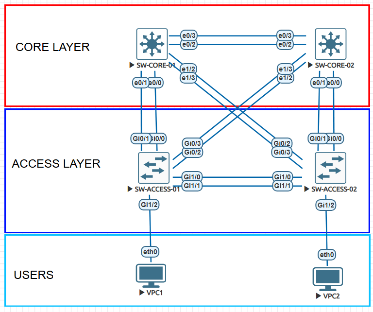

# Cisco CCNA Lab: Link Aggregation (LACP, PAgP & Static EtherChannel) - L2/L3 Implementation & Packet Analysis

## Overview
This lab demonstrates the implementation, verification, and packet-level analysis of Link Aggregation Groups (LAG / EtherChannel) operating across Layer 2 and Layer 3 boundaries. The topology implements standard IEEE 802.3ad (LACP), Cisco PAgP, static link bundling, load-balancing hash algorithms, and interaction with the Spanning Tree Protocol (STP).

## Why Use Link Aggregation? (Problem & Solution)

### The Problem in Traditional Campus Networks
In standard switched topologies, connecting multiple physical links between two switches creates Layer 2 switching loops. To prevent broadcast storms, MAC address table instability, and multiple frame transmission, the **Spanning Tree Protocol (STP)** detects the redundant loop and transitions all extra links into a **blocking (discarding)** state.

As a result:
* **Bandwidth Underutilization:** Redundant physical cables remain idle, wasting available throughput (e.g., in a dual 1 Gbps uplink setup, only 1 Gbps is usable while the other link sits in standby).
* **Slow Failover / STP Re-convergence:** When an active link fails, STP must recalculate the topology, which can cause brief packet loss and temporary network disruption during state transitions.

---

### The Solution: Link Aggregation (EtherChannel / LAG)
Link Aggregation bundles up to **8 active physical links** (and up to 8 additional standby links with LACP) into a single **logical interface** called a **Port-Channel**.

* **Aggregated Bandwidth:** Combines the throughput of all member links into a single high-speed pipe (e.g., 2x 1 Gbps links = 2 Gbps aggregated logical capacity).
* **Seamless Redundancy & Fast Failover:** If an individual physical interface fails, traffic is immediately redistributed across the remaining active links in the bundle without triggering an STP recalculation or link-state convergence delay.
* **STP Optimization:** STP sees the entire bundle as **one single logical port**, allowing all physical cables to forward traffic simultaneously without being blocked.
* **Deterministic Load Balancing:** Distributes outbound frames across physical links based on mathematical hash algorithms (Layer 2 MAC, Layer 3 IP, or Layer 4 Port headers).

---

### Link Aggregation Types & Protocols Comparison

| Feature / Metric | LACP (Link Aggregation Control Protocol) | PAgP (Port Aggregation Protocol) | Static EtherChannel (`mode on`) |
| :--- | :--- | :--- | :--- |
| **Standard** | **IEEE 802.3ad / IEEE 802.1AX** (Open Standard) | **Cisco Proprietary** | Non-standard / Manual |
| **Vendor Support** | Multi-vendor (Cisco, Juniper, Arista, Linux, etc.) | Cisco devices only | Most managed enterprise switches |
| **Operational Modes** | `active` / `passive` | `desirable` / `auto` | `on` |
| **Automatic Negotiation** | Yes (exchanges LACPDUs via `01:80:c2:00:00:02`) | Yes (exchanges PAgP packets via `01:00:0c:cc:cc:cc`) | No (forces links directly into bundle) |
| **Misconfiguration Protection** | **High** (suspends ports on parameter/speed mismatch) | **High** (suspends ports on mismatch) | **Low** (can cause loops or blackholes if mismatched) |
| **Maximum Active Links** | Up to **8 active** + 8 standby (hot-standby support) | Up to **8 active** (no hot-standby) | Up to **8 active** |
| **Industry Recommendation** | **Standard Best Practice for all modern designs** | Legacy / Cisco-only environments | Deprecated / Specialized host clustering |

---

### Layer 2 vs. Layer 3 EtherChannel

* **Layer 2 EtherChannel:** Bundles switch access or trunk ports together. Carries VLAN tagged traffic (`dot1q`) across campus distribution/access layers, operating under Layer 2 MAC forwarding rules.
* **Layer 3 (Routed) EtherChannel:** Configured by disabling switchport mode (`no switchport`) on member interfaces and assigning an IP address directly to the logical `Port-channel` interface. Eliminates Layer 2 Spanning Tree entirely on the link, acting as a high-bandwidth point-to-point routed transit connection for dynamic routing protocols (OSPF, EIGRP, BGP).

---

## Topology



## Interface & Port-Channel Mapping

| Port-Channel | Source Device | Source Interfaces | Destination Device | Destination Interfaces | Type | Protocol / Mode | Description |
| :---: | :---: | :---: | :---: | :---: | :---: | :---: | :--- |
| **Po1** | SW-ACCESS-01 | `Gi1/0`, `Gi1/1` | SW-ACCESS-02 | `Gi1/0`, `Gi1/1` | Layer 2 Trunk | LACP (`active` / `passive`) | Access Layer Peer-Link |
| **Po2** | SW-CORE-01 | `Et0/0`, `Et0/1` | SW-ACCESS-01 | `Gi0/0`, `Gi0/1` | Layer 2 Trunk | LACP (`passive` / `active`) | Primary Uplink - Core 01 to Access 01 |
| **Po3** | SW-CORE-01 | `Et0/2`, `Et0/3` | SW-CORE-02 | `Et0/2`, `Et0/3` | Layer 3 Routed | LACP (`active` / `active`) | Core Interconnect (`10.0.0.0/30`) |
| **Po4** | SW-CORE-01 | `Et1/2`, `Et1/3` | SW-ACCESS-02 | `Gi0/2`, `Gi0/3` | Layer 2 Trunk | LACP (`active` / `passive`) | Redundant Cross-Link - Core 01 to Access 02 |
| **Po5** | SW-CORE-02 | `Et1/2`, `Et1/3` | SW-ACCESS-01 | `Gi0/2`, `Gi0/3` | Layer 2 Trunk | LACP (`active` / `passive`) | Redundant Cross-Link - Core 02 to Access 01 |
| **Po6** | SW-CORE-02 | `Et0/0`, `Et0/1` | SW-ACCESS-02 | `Gi0/0`, `Gi0/1` | Layer 2 Trunk | LACP (`active` / `passive`) | Primary Uplink - Core 02 to Access 02 |

---

### Host Access Ports

| Device | Interface | Connected Host | Mode | VLAN |
| :--- | :--- | :--- | :--- | :--- |
| **SW-ACCESS-01** | `Gi1/2` | VPC1 (`eth0`) | Access | VLAN 10 |
| **SW-ACCESS-02** | `Gi1/2` | VPC2 (`eth0`) | Access | VLAN 20 |

---

## Device Configurations


SW-ACCESS-01 (L2 Access Switch)
```
! Access peer-link to SW-ACCESS-02
interface range GigabitEthernet1/0 - 1
 switchport trunk encapsulation dot1q
 switchport mode trunk
 channel-group 1 mode active
 no shutdown
exit

! Primary uplink to SW-CORE-01
interface range GigabitEthernet0/0 - 1
 switchport trunk encapsulation dot1q
 switchport mode trunk
 channel-group 2 mode active
 no shutdown
exit
```

SW-ACCESS-02 (L2 Access Switch)
```
! Access peer-link to SW-ACCESS-01
interface range GigabitEthernet1/0 - 1
 switchport trunk encapsulation dot1q
 switchport mode trunk
 channel-group 1 mode passive
 no shutdown
exit
```

SW-CORE-01 (L3 Multilayer Switch)
```
! Downlink to SW-ACCESS-01 (Layer 2 Trunk)
interface range Ethernet0/0 - 1
 switchport trunk encapsulation dot1q
 switchport mode trunk
 channel-group 1 mode passive
 no shutdown
exit

! Core-to-Core Interconnect (Layer 3 Routed Port-Channel)
interface range Ethernet0/2 - 3
 no switchport
 channel-group 3 mode active
 no shutdown
exit

interface Port-channel 3
 no switchport
 ip address 10.0.0.1 255.255.255.252
 no shutdown
exit
```

---

## Verification & State Inspection

### 1. Dual-Stack L2 and L3 EtherChannel Validation
Running show etherchannel summary on SW-CORE-01 verifies both Layer 2 and Layer 3 Port-Channels running simultaneously:


```
SW-CORE-01# show etherchannel summary
Flags:  D - down        P - bundled in port-channel
        I - stand-alone s - suspended
        H - Hot-standby (LACP only)
        R - Layer3      S - Layer2
        U - in use      N - not in use, no aggregation
        
Group  Port-channel  Protocol  Ports
------+-------------+----------+-----------------------------------------------
1      Po1(SU)         LACP     Et0/0(P)    Et0/1(P)    
3      Po3(RU)         LACP     Et0/2(P)    Et0/3(P)

```

* **Po1 (SU):** S (Layer 2), U (In use) with member ports Et0/0 and Et0/1 flagged as P (bundled in port-channel).
* **Po3 (RU):** R (Layer 3), U (In use) with member ports Et0/2 and Et0/3 bundled.

---

## Deep Dive: LACP Packet Dissection (Wireshark)


Frame captures highlight the structure of IEEE 802.3ad control packets:

* Multicast Destination: 01:80:c2:00:00:02 (Slow Protocols Multicast MAC, EtherType 0x8809, Subtype 0x01).
* Actor State (0x3d - Active):
  * Activity: Active (1)
  * Aggregation: Aggregatable (1)
  * Synchronization: In Sync (1)
  * Collecting: Enabled (1)
  * Distributing: Enabled (1)
* Actor State (0x3c - Passive):
  * Activity: Passive (0)
  * Synchronized, Collecting, and Distributing are enabled after initial negotiation by the active peer.
* TLV Exchange: Both peers exchange System Priority (default 32768), System ID (base MAC address), Port Priority, and Port Key to ensure matching bundle parameters prior to forwarding data frames.

## EtherChannel Load-Balancing Algorithms
The load-balancing hash distribution was tested and configured at the global configuration level:


```
! Inspect default hash configuration (Source XOR Destination IP)
SW-CORE-01# show etherchannel load-balance
EtherChannel Load-Balancing Configuration:
        src-dst-ip

Non-IP: Source XOR Destination MAC address
  IPv4: Source XOR Destination IP address
  IPv6: Source XOR Destination IP address

! Configure source-IP based load balancing
SW-CORE-01(config)# port-channel load-balance src-ip
SW-CORE-01# show etherchannel load-balance
EtherChannel Load-Balancing Configuration:
        src-ip
```

---

## Troubleshooting & Failure Analysis

### Scenario 1: Protocol Mode Mismatch (LACP `active` vs. Static `on`)

* **Symptom:** Member interfaces are placed into a suspended state `(s)`, the logical Port-Channel transitions to **SD** (Layer 2 Down) on the LACP side, and repetitive error logs are generated.
* **CLI Evidence:**
  ```
  *Aug 26 16:32:08.494: %EC-5-L3DONTBNDL2: Et0/1 suspended: LACP currently not enabled on the remote port.
  *Aug 26 16:32:08.898: %EC-5-L3DONTBNDL2: Et0/0 suspended: LACP currently not enabled on the remote port.

  SW-ACCESS-01# show etherchannel summary
  Group  Port-channel  Protocol  Ports
  ------+-------------+----------+-----------------------------------------------
  1      Po1(SD)         LACP     Gi1/0(s)    Gi1/1(s)
  ```

  * **Root Cause:** Negotiation mismatch. The active mode requires bidirectional exchange of LACPDUs (IEEE 802.3ad), whereas the on mode unconditionally forces aggregation without sending or processing control frames.
  * **Resolution:** Align negotiation parameters across both endpoints. For standard LACP, set both peers to channel-group X mode active (or active + passive).

---

### Scenario 2: Channel-Group Removal & Interface Teardown

* **Symptom:** Immediate logical link teardown and traffic disruption across Layer 2 / Layer 3 boundaries.

* **CLI Evidence:**
```
SW-ACCESS-02(config-if-range)# no channel-group 1 mode passive
*Aug 26 16:12:10.769: %LINK-3-UPDOWN: Interface Port-channel1, changed state to down
*Aug 26 16:12:11.769: %LINEPROTO-5-UPDOWN: Line protocol on Interface Port-channel1, changed state to down
```

* **Root Cause:** Removing physical interfaces via no channel-group strips the logical Port-channel 1 of all active forwarders, triggering an immediate line protocol shutdown.
* **Resolution:** Rebind the physical interfaces to the designated group and issue no shutdown across both member links and the Port-Channel interface.

---

### Scenario 3: LACP Timeout / Out of Sync (Wireshark Packet Dissection)

* **Symptom:** Physical member ports fail to form a bundle and indicate an un-synchronized state with Defaulted, Expired flags in frame captures.
* **Packet Evidence (Wireshark):**
    * **Actor State Flags** (0xc5): LACP Activity: Active, Synchronization: Out of Sync (0), Collecting: Disabled (0), Distributing: Disabled (0), Defaulted: Yes (1), Expired: Yes (1).
    * **Partner State:** Null/zeroed fields (00:00:00:00:00:00), confirming no valid LACPDUs were received from the remote peer.
* **Root Cause:** The local switch ceased receiving keepalive LACPDUs from its peer within the timeout interval, forcing the state machine to revoke frame collection and distribution permissions.
* **Resolution:** Verify Layer 1 physical continuity, verify interface operational status (no shutdown), and confirm that control protocol packets are not being dropped or blocked upstream.

---

### EtherChannel Pre-Configuration Checklist

Before bundling physical links into a Port-Channel, verify strict parameter parity across all member interfaces:

**1. Speed & Duplex:** Identical transmission speed and full-duplex operation across all member ports.
**2. Switchport Mode:** All interfaces must share the exact same operational mode (access on the same VLAN ID, or trunk with identical allowed VLAN lists and native VLANs).
**3. Encapsulation:** Identical trunk encapsulation protocol (switchport trunk encapsulation dot1q).
**4. Layer 3 Consistency:** For routed EtherChannels, execute no switchport on physical member interfaces before configuring IP addressing on the logical Port-Channel.

---

### Spanning Tree Protocol (STP) Integration
The Spanning Tree Protocol treats each bundle as a single point-to-point link:


```
SW-ACCESS-02# show spanning-tree

VLAN0001
  Spanning tree enabled protocol ieee
  Root ID    Priority    32769
             Address     5000.0001.0000
             Cost        3
             Port        65 (Port-channel1)
             Hello Time   2 sec  Max Age 20 sec  Forward Delay 15 sec

Interface        Role Sts Cost      Prio.Nbr Type
---------------- ---- --- --------- -------- --------------------------------
Po1              Root FWD 3         128.65   P2p
```
* Reduced Cost: The Port-Channel receives an STP cost reflecting aggregated bandwidth (Cost = 3 for 2x Gigabit interfaces).
* Loop Prevention: STP blocks or unblocks redundant Port-Channel logical interfaces as a single unit without shutting down individual member links.

---

## CLI Verification Cheat Sheet

| Command | Purpose | Expected Output / Key Flags |
| :--- | :--- | :--- |
| `show etherchannel summary` | Quick status of all bundles and member ports | `SU` (L2 In-Use), `RU` (L3 In-Use), `P` (Bundled) |
| `show etherchannel port-channel` | Detailed active ports, protocol, and link index | Displays member count and logical channel uptime |
| `show lacp neighbor` | Bidirectional validation of remote LACP state | Validates Partner System ID, Priority, and Key |
| `show etherchannel load-balance` | Verifies the active hashing algorithm | Displays active framing method (`src-dst-ip`, etc.) |
| `show spanning-tree` | Verifies STP logical port cost and state | Displays `PoX` as single interface with aggregated cost |

---

## Summary of Findings

* **LACP Negotiation & Stability:** Full convergence requires at least one active peer (`active` + `active` or `active` + `passive`). Mismatched static configurations (`on` vs. `active`) trigger immediate port suspension to prevent forwarding loops.
* **Layer 3 Routed Bundling:** Applying `no switchport` across physical members and the logical Port-Channel allows native IP assignment and point-to-point Layer 3 transit without Spanning Tree overhead.
* **Spanning Tree Optimization:** STP detects the aggregated Port-Channel as a single logical interface with reduced path cost, blocking redundant topology paths at the bundle level rather than per-physical link.
* **Traffic Distribution:** Global load-balancing hash algorithms distribute traffic across member links based on packet headers (MAC/IP) without causing out-of-order packet delivery.

---

## Standards & Official References

* **IEEE 802.3ad / IEEE 802.1AX**: Standards for Local and Metropolitan Area Networks — Link Aggregation (LACP specifications, Actor/Partner state machines, and Slow Protocols frame formats).
* **IEEE 802.1D / IEEE 802.1w**: Media Access Control (MAC) Bridges and Rapid Spanning Tree Protocol (RSTP interaction with aggregated logical interfaces).
* **IEEE 802.1Q**: Virtual Bridged Local Area Networks (VLAN tagging and trunk encapsulation across Port-Channels).
* **Cisco Systems Documentation**:
  * *Configuring Layer 2 and Layer 3 EtherChannel (Catalyst Switching Guides)*
  * *Port Aggregation Protocol (PAgP) Proprietary Specification and Modes*
  * *Understanding EtherChannel Load-Balancing and Frame Distribution Algorithms*


