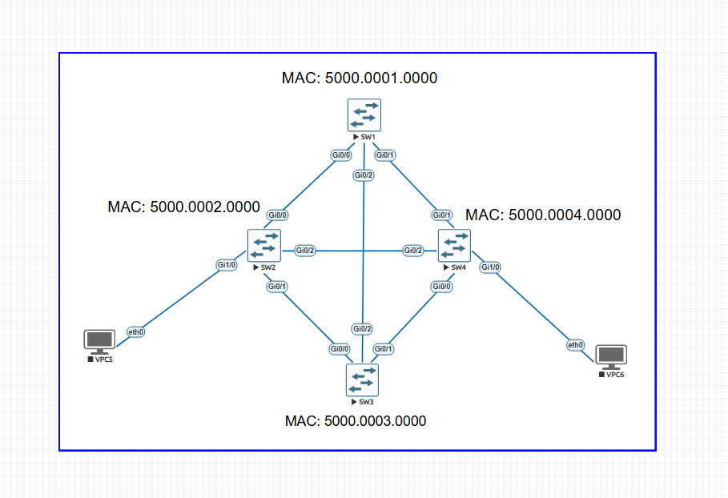

# CCNA Lab: Spanning Tree Protocol (STP) & Rapid STP (RSTP) Fundamentals

## Overview

Redundancy is critical in modern network design to ensure high availability. However, redundant Layer 2 physical links created in an Ethernet mesh topology naturally form physical loops. Without a loop-prevention protocol, Layer 2 frames circulate infinitely, causing devastating network failures.

This laboratory provides a comprehensive analysis of Layer 2 loop prevention, bridging theory and hands-on implementation. We examine the core mechanics of IEEE 802.1D (STP / PVST+) and demonstrate the evolutionary transition to IEEE 802.1w (Rapid STP / Rapid-PVST+), focusing on convergence timing, port roles, and operational states.

---

## Technical Background

### The Layer 2 Loop Problem

Unlike Layer 3 IP packets—which feature a Time-To-Live (TTL) header field to drop looped packets—Ethernet Layer 2 frames lack a TTL field. In a topology with redundant physical paths and no spanning-tree protocol, three major issues occur:

1. **Broadcast Storms:** Switches continuously flood broadcast frames (such as ARP Requests) out of all interfaces except the receiving one. These frames loop endlessly, consuming 100% of available bandwidth and causing CPU starvation across network devices.
2. **MAC Address Table Instability:** The constant arrival of identical source MAC addresses on different physical interfaces forces switches to continually rewrite their CAM (Content Addressable Memory) tables, crippling frame forwarding logic.
3. **Multiple Frame Transmission:** End hosts receive duplicate copies of unicast frames, leading to protocol stack errors at the upper layers.

---

### How Spanning Tree Protocol (STP) Solves the Problem

The Spanning Tree Protocol constructs a logical loop-free tree topology by strategically blocking redundant physical ports. The decision process follows an exact deterministic order:

1. **Elect One Root Bridge:** The switch with the lowest Bridge ID (BID) is elected as the central reference point for the entire Layer 2 domain.
   $$\text{Bridge ID (BID)} = \text{Bridge Priority} + \text{Extended System ID (VLAN ID)} + \text{MAC Address}$$
2. **Determine Root Ports (RP):** Every non-Root switch elects exactly one Root Port—the interface leading to the Root Bridge with the lowest cumulative Path Cost.
3. **Determine Designated Ports (DP):** Every network segment (collision domain) elects one Designated Port to forward traffic based on the lowest path cost toward the Root Bridge.
4. **Block Remaining Ports (Alternate Ports):** All other interfaces not designated as Root or Designated ports are placed into a Blocking state to break physical loops.

---

### IEEE 802.1D (STP / PVST+) vs IEEE 802.1w (RSTP / Rapid-PVST+)

#### IEEE 802.1D Port States & Timers
Classic STP relies on passive timers to safely transition interfaces without creating temporary loops, resulting in slow convergence times (up to 50 seconds):

| Port State | Function | Timer |
| :--- | :--- | :--- |
| **Blocking** | Drops data frames, listens to BPDUs | Max Age (20s) |
| **Listening** | Processes BPDUs, builds topology without learning MACs | Forward Delay (15s) |
| **Learning** | Populates MAC address table, drops data frames | Forward Delay (15s) |
| **Forwarding** | Sends and receives user data frames | Active Forwarding |
| **Disabled** | Administrative down state | N/A |

#### IEEE 802.1w Port States & Convergence Mechanics
RSTP dramatically improves convergence times down to milliseconds by consolidating port states and introducing an active negotiation mechanism called **Proposal / Agreement**:

| 802.1D State | 802.1w State | Operational Status |
| :--- | :--- | :--- |
| Disabled | **Discarding** | Drops data, populates no MACs |
| Blocking | **Discarding** | Drops data, listens to BPDUs |
| Listening | **Discarding** | Drops data, processes BPDUs |
| Learning | **Learning** | Populates MAC table, drops data |
| Forwarding | **Forwarding** | Active data transmission |

### IEEE Standards vs Cisco Proprietary Implementations (STP/RSTP vs PVST+/Rapid-PVST+)

Standard IEEE 802.1D (Common Spanning Tree - CST) maintains a **single spanning-tree instance** for the entire physical network, regardless of how many VLANs are configured. While computationally light, CST prevents per-VLAN traffic engineering and can result in suboptimal routing or unused redundant bandwidth.

Cisco enhanced these standards by introducing **Per-VLAN Spanning Tree (PVST+)** and **Rapid-PVST+**:

* **IEEE 802.1D (CST) vs Cisco PVST+:** Standard 802.1D evaluates one topology for all VLANs. Cisco PVST+ spawns an independent 802.1D Spanning Tree instance for **each active VLAN**, allowing deterministic load balancing across redundant trunks at the cost of higher switch CPU/RAM overhead.
* **IEEE 802.1w (RSTP) vs Cisco Rapid-PVST+:** Standard 802.1w provides rapid convergence for a single CST instance. Cisco Rapid-PVST+ applies 802.1w convergence mechanics (Proposal/Agreement) to **every individual VLAN instance**.
* **Encapsulation & BPDU Handling:** CST sends BPDUs untagged over IEEE 802.1Q trunks using the standard MAC address `0180.c200.0000`. PVST+ and Rapid-PVST+ encapsulate BPDUs with a proprietary SNAP header sent to MAC address `0100.0ccc.cccd`, carrying VLAN tags to maintain separate per-VLAN topologies across 802.1Q trunks.

| Feature / Metric | IEEE 802.1D (CST) | Cisco PVST+ | IEEE 802.1w (RSTP) | Cisco Rapid-PVST+ |
| :--- | :--- | :--- | :--- | :--- |
| **Standard** | IEEE Open Standard | Cisco Proprietary | IEEE Open Standard | Cisco Proprietary |
| **Instances** | Single (1 for all VLANs) | Multi (1 per VLAN) | Single (1 for all VLANs) | Multi (1 per VLAN) |
| **Convergence** | Slow (~30-50s) | Slow (~30-50s) | Rapid (<2s) | Rapid (<2s) |
| **Resource Usage** | Very Low | High (CPU/RAM per VLAN) | Low | High (CPU/RAM per VLAN) |

---

## Topology Architecture



### Interconnection Matrix

| Source Device | Source Port | Target Device | Target Port | Connection Type |
| :--- | :--- | :--- | :--- | :--- |
| **SW1** | `Gi0/0` | **SW2** | `Gi0/0` | Trunk (802.1Q) |
| **SW1** | `Gi0/1` | **SW4** | `Gi0/1` | Trunk (802.1Q) |
| **SW1** | `Gi0/2` | **SW3** | `Gi0/2` | Trunk (802.1Q) |
| **SW2** | `Gi0/1` | **SW3** | `Gi0/0` | Trunk (802.1Q) |
| **SW2** | `Gi0/2` | **SW4** | `Gi0/2` | Trunk (802.1Q) |
| **SW2** | `Gi1/0` | **VPCS5** | `eth0` | Access (VLAN 1) |
| **SW3** | `Gi0/1` | **SW4** | `Gi0/0` | Trunk (802.1Q) |
| **SW4** | `Gi1/0` | **VPCS6** | `eth0` | Access (VLAN 1) |

---

## Configuration Guide

### 1. Initial Configuration

SW1

```
! Baseline Configuration applied to all switches (adjust hostname accordingly)
enable
configure terminal
hostname SW1
no ip domain-lookup

! Disable all unused interfaces to avoid unintended topology interference
interface range GigabitEthernet0/3, GigabitEthernet1/1 - 3
 shutdown
 exit

! Configure active Inter-Switch Links as 802.1Q Trunks
interface range GigabitEthernet0/0 - 2
 switchport trunk encapsulation dot1q
 switchport mode trunk
 no shutdown
 exit

! Console line hardening and productivity settings
line con 0
 exec-timeout 0 0
 logging synchronous
 exit
end
write memory
```

###Configuration Rationale & Best Practices:
- no ip domain-lookup: By default, Cisco IOS treats any typo or unrecognised CLI command as a domain name and attempts a broadcast DNS lookup via port 53. This causes the CLI to freeze for up to 30 seconds while waiting for the DNS resolver to time out. Disabling domain lookup keeps the console responsive.

- exec-timeout 0 0: Sets the console session inactivity timer to infinity (minutes seconds). This prevents the switch from automatically logging out the administrator during extended lab testing and packet capture sessions. (Note: Strictly recommended for lab environments only; production devices should maintain a strict timeout for security).

- logging synchronous: Prevents unsolicited system log messages (syslog notifications, interface up/down alerts) from interrupting and splitting commands currently being typed into the CLI prompt. The IOS redisplays the half-typed command on a clean new line immediately after outputting the system message.

- shutdown on Unused Interfaces: Layer 2 security and operational best practice. Unused switch ports left enabled can cause accidental spanning-tree topology recalibrations if connected incorrectly, or introduce security vulnerabilities (e.g., unauthorized switch attachments).

---
### 2. Default PVST+ Execution & Observations

Under factory default settings, all switches run Cisco PVST+ with the default priority of `32768` (resulting in a Bridge Priority of `32769` when including the Extended System ID for VLAN 1).


#### Baseline MAC & Bridge IDs:
* **SW1:** `32769 : 5000.0001.0000` (Lowest MAC Address $\rightarrow$ **Elected Root Bridge**)
* **SW2:** `32769 : 5000.0002.0000`
* **SW3:** `32769 : 5000.0003.0000`
* **SW4:** `32769 : 5000.0004.0000`

---

### Decision Breakdown (Why Each Port is Forwarding or Blocking):

1. **SW1 (Root Bridge):**
   * Since SW1 possesses the lowest system MAC address (`5000.0001.0000`), it wins the Root Bridge election.
   * All active operational interfaces (`Gi0/0`, `Gi0/1`, `Gi0/2`) assume the **Designated Port (Desg / FWD)** role.

2. **SW2:**
   * **Root Port:** `Gi0/0` (Direct link to SW1 with the lowest cumulative Root Path Cost = `4`).
   * **Designated Ports:** `Gi0/1` (toward SW3), `Gi0/2` (toward SW4), and `Gi1/0` (access port to VPCS5) remain in **FWD** state because SW2 has a lower Bridge ID than SW3 and SW4 on those segments.

3. **SW3:**
   * **Root Port:** `Gi0/2` (Direct link to SW1 with Root Path Cost = `4`).
   * **Designated Port:** `Gi0/1` (toward SW4, because SW3's MAC `5000.0003.0000` is lower than SW4's MAC `5000.0004.0000`).
   * **Alternate / Blocked Port:** `Gi0/0` (**Altn / BLK**) is placed into the Blocking state to prevent a loop with SW2.

4. **SW4:**
   * **Root Port:** `Gi0/1` (Direct link to SW1 with Root Path Cost = `4`).
   * **Alternate / Blocked Ports:**
     * `Gi0/0` (**Altn / BLK**) is blocked toward SW3.
     * `Gi0/2` (**Altn / BLK**) is blocked toward SW2.
   * **Designated Port:** `Gi1/0` (Access port to VPCS6) remains in **FWD** state.

---

## Wireshark Protocol Analysis

To validate protocol mechanics at the data link layer, packet captures were analyzed on the trunk link between **SW1** and **SW2**.

### 1. IEEE 802.1D / PVST+ Configuration BPDU Deep Dive

Under classic PVST+, the elected Root Bridge originates and floods Configuration BPDUs periodically every **2.0 seconds** (Hello Time) across the Layer 2 broadcast domain.


#### Packet Analysis Breakdown:
* **Destination Multicast MAC:** `01:80:c2:00:00:00` (*Nearest-Customer-Bridge / Spanning Tree Multicast*).
* **Source MAC Address:** `50:00:00:01:00:00` (Originating interface from Root Bridge **SW1**).
* **Protocol Version Identifier:** `0` $\rightarrow$ Indicates Classic IEEE 802.1D Spanning Tree.
* **BPDU Type:** `0x00` $\rightarrow$ Standard **Configuration BPDU** (used for tree topology maintenance).
* **BPDU Flags (`0x00`):** 
  * `Topology Change Acknowledgment (TCA) = No` (Bit 7).
  * `Topology Change (TC) = No` (Bit 0).
  * *Note:* Classic STP utilizes only the two outer bits of the 8-bit flag byte, leaving intermediate bits unused.
* **Root Identifier:** `32768 / 1 / 50:00:00:01:00:00` (Priority `32768` + System ID Extension `1` = Total BID `32769`).
* **Root Path Cost:** `0` (Since the frame originated directly from the Root Bridge).
* **Protocol Timers:** 
  * `Message Age: 0`
  * `Max Age: 20`
  * `Hello Time: 2`
  * `Forward Delay: 15`

---

### Empirical Results Comparison

| Metric | PVST+ (802.1D) | Rapid-PVST+ (802.1w) |
| :--- | :--- | :--- |
| **Observed Downtime / Failover** | ~30 - 50 seconds | ~1 - 3 seconds |
| **Packet Loss Count** | 30+ lost ICMP packets | 1-2 lost ICMP packets |
| **Transition Mechanics** | Timer-driven | Proposal/Agreement |

> **Note on Convergence Measurements:** The failover times and packet loss metrics listed above reflect empirical data captured within this emulated lab environment. In production networks, actual convergence times may vary depending on link speed, hardware platform processing, physical distance (propagation delay), and total network diameter.

---

## Next Steps in This Repository

Now that foundational Layer 2 loop prevention and rapid convergence concepts are established, continue exploring the evolution of Spanning Tree implementation:

* **Next Level Advanced:** [PVST+ & Rapid-PVST+ Per-VLAN Load Balancing]()
* **Enterprise Level:** [MSTP (802.1s) & L2 Hardening Security]()

---

## References & Further Reading

* [IEEE 802.1D Standard: Media Access Control (MAC) Bridges](https://standards.ieee.org/)
* [IEEE 802.1w Standard: Rapid Reconfiguration of Spanning Tree](https://standards.ieee.org/)
* [Cisco Technical Support: Understanding Spanning-Tree Protocol State Transitions](https://www.cisco.com/)
* Cisco Networking Academy: CCNA: Switching, Routing, and Wireless Essentials (SRWE)


